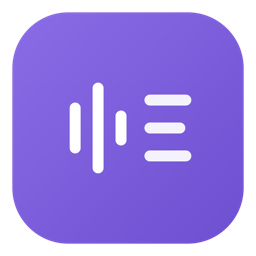
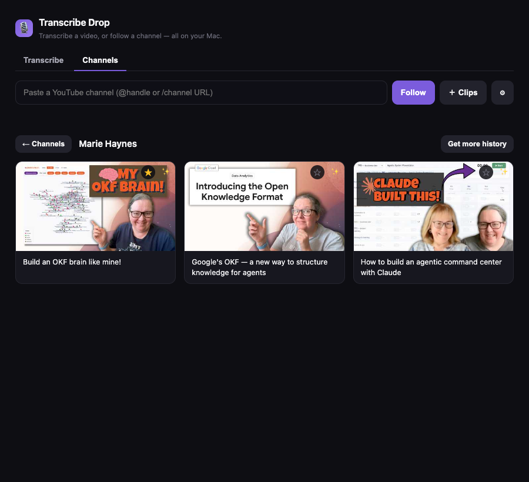

<div align="center">
  
  <h1>Transcribe Drop</h1>
  <p><b>Transcribe any video, or follow a YouTube channel and let AI tell you what's worth watching — all on your Mac.</b></p>
</div>



Transcription runs entirely on your machine (whisper.cpp) — no accounts, no per-minute charges, nothing leaves your Mac. The only optional online part is the AI summaries.

## What it does

- **Transcribe** any video or audio — paste a URL (YouTube, Facebook, …) or drop a file. Local, free, private.
- **Follow a YouTube channel** — it lists the latest videos, transcribes them (YouTube captions first, on-device Whisper as fallback), and shows them in a grid.
- **AI summaries** — click a video and Claude Haiku summarises it, tuned to a short "what I'm working on" context file, flagging what's **relevant to you** (the ✨). Summaries are generated on demand, so you only pay for what you actually open (~1¢ each, then cached).
- **Collections** — group pasted video/reel URLs (including Facebook reels) under any name you like.
- **Watch-later checklist** — star videos (☆) and check them off as you get through them.

## Install (macOS)

1. Download **`Transcribe-Drop-vX.Y.Z.zip`** from the [latest release](https://github.com/djaysan/transcribe-drop/releases/latest).
2. Unzip it, then **double-click `Install.command`**. First time only: right-click it → **Open** to approve (it's an unsigned local script).
3. It installs the command-line tools, sets up an isolated Python environment, and builds **Transcribe Drop.app** right there.
4. Drag **Transcribe Drop.app** to your Applications folder. First launch: right-click → **Open** (unsigned app — no Apple Developer account needed).

Requires [Homebrew](https://brew.sh) — the installer uses it to fetch `yt-dlp`, `ffmpeg`, and `whisper-cpp`. The ~148 MB transcription model downloads automatically the first time it's needed.

## AI summaries (optional)

Open **⚙ Settings**, paste an [Anthropic API key](https://console.anthropic.com), and — optionally — pick a context file describing what you do (there's a built-in prompt to generate one with Claude). Without a key the app still lists and transcribes everything; it just skips the summaries. Everything except the summaries is free and local.

## Notes

- **Facebook:** individual reels work (paste them under ＋ Clips); following a whole FB profile isn't possible — its reels tab can't be listed.
- Your data (transcripts, settings, model) lives in `~/Library/Application Support/Transcribe Drop`, so the app is fully movable.
- Built with [yt-dlp](https://github.com/yt-dlp/yt-dlp) + [whisper.cpp](https://github.com/ggerganov/whisper.cpp) + [ffmpeg](https://ffmpeg.org) (transcription), Claude Haiku (summaries), and [pywebview](https://pywebview.flowrl.com) (UI).

## Run from source

Prefer not to build the app? `./install.sh` does everything, or run it directly:

```sh
brew install yt-dlp ffmpeg whisper-cpp
pip install pywebview anthropic
python3 transcribe-app.py
```

## License

MIT — see [LICENSE](LICENSE).
